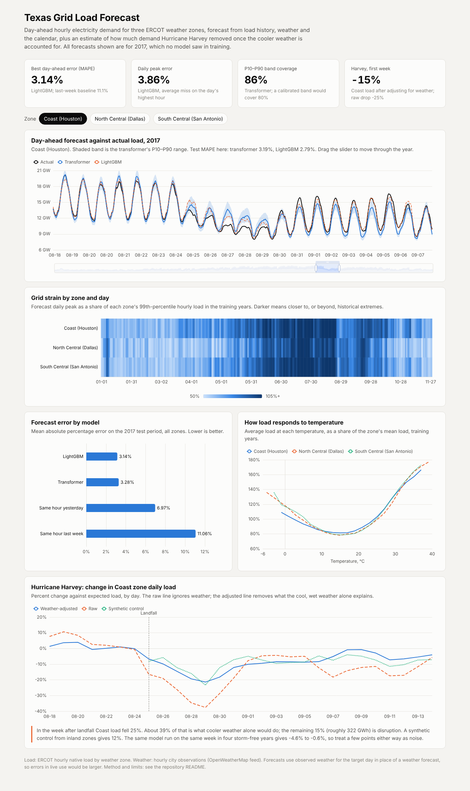

# Texas Grid Load Forecast

Day-ahead hourly electricity demand for three ERCOT weather zones, and a causal estimate of what Hurricane Harvey did to demand once the cooler weather is separated out.

**Live dashboard:** https://satwik-kotta.github.io/grid-load-forecast/



## What it found

**Forecasting, 2017 test period (332 days, never used in training):**

| Model | Hourly MAPE | MAE | Daily peak MAPE |
|---|---|---|---|
| Same hour last week | 11.06% | 1,166 MW | 12.80% |
| Same hour yesterday | 6.97% | 723 MW | 7.73% |
| LightGBM | **3.14%** | 332 MW | 3.86% |
| Transformer | 3.28% | 341 MW | **3.32%** |

The transformer did not beat gradient boosting on hourly error. It was better on the daily peak, the number an operator cares about most, and it gives a range: its P10 to P90 band contained the actual load 86% of the time (80% would be perfectly calibrated).

**Hurricane Harvey, Coast zone, week after landfall (26 Aug to 1 Sep 2017):**

| Estimate | Change in load |
|---|---|
| Raw drop against expected load | −25% |
| After adjusting for weather | −15% (about 322 GWh) |
| Synthetic control from inland zones | −12% |
| Same model, same week, four storm-free years | −0.6% to −4.6% |

Harvey was cool and wet, and cool weather lowers August demand on its own. About 39% of the raw drop is what the weather alone would have done. The rest is disruption: outages, flooding, closed plants and offices.

## Data

- **Load:** ERCOT hourly native load by weather zone, 2012 to 2017.
- **Weather:** hourly temperature, humidity, wind and sky description for Houston, Dallas and San Antonio, Oct 2012 to Nov 2017.
- **Zones modelled:** Coast (Houston), North Central (Dallas), South Central (San Antonio). 45,252 aligned hours per zone.

ERCOT reports "hour ending" in Central time and the weather feed is UTC. `src/etl.py` aligns both on the UTC hour each interval starts, handles both daylight-saving edge cases, and checks that the eight zones sum to the ERCOT total.

## Method

**Forecast set-up.** Each day at 06:00 UTC (midnight Central standard time) forecast the next 24 hourly loads. Load is known up to the hour before. Train Oct 2012 to Jun 2016, validate Jul to Dec 2016, test Jan to Nov 2017.

**LightGBM.** Lagged load ratios, weather, degree hours, calendar and holidays. The target is load relative to the previous day's average, so one model serves all zones. A test confirms no feature changes when load on the forecast day is altered.

**Transformer.** Encoder-decoder, 248k parameters, written in PyTorch. The encoder reads 168 hours of load, weather and calendar; the decoder receives the next 24 hours of weather and calendar and outputs P10, P50 and P90, trained with quantile loss. This follows the idea behind the Temporal Fusion Transformer (known-future inputs, quantile outputs) without its variable-selection and gating layers.

**Causal analysis.** Daily panel of the three zones, 5,616 zone-days:

```
log(load) = zone + zone×weekday + zone×holiday + zone trend
          + year-month effects                  (shocks shared by all zones)
          + zone-specific weather response      (cooling and heating degrees, squares, lags, humidity, cloud)
          + Coast × event-day dummies           (the estimate)
```

Three checks: dummies for the week before landfall, the same window in 2013 to 2016 as placebos, and a synthetic control for Coast built from five inland zones fitted on June to mid-August 2017.

## Limits

- **Observed weather stands in for a weather forecast.** Forecast-day weather comes from the record, so live errors would be higher than the table shows.
- **No measured irradiance or cloud cover.** Sky cover is mapped from text descriptions and sun elevation is computed. The brief's "solar irradiance" is a proxy here.
- **One weather station per zone.** Each zone covers many counties.
- **The regression's confidence intervals are too narrow.** They are about ±1.5 points, yet two of seven pre-landfall days differ from zero and a placebo year reaches −4.6%. Read the Harvey estimate as roughly −15% give or take 4 to 5 points.
- **Control zones were not untouched.** South Central also got Harvey's rain. If its load fell for non-weather reasons, the Coast effect is understated.
- **Macroeconomic controls are indirect.** Year-month effects and zone trends absorb shared and slow-moving economic changes. No employment or output series is included.
- **Both models over-forecast during Harvey**, as expected: neither knows about outages.

## Run it

```bash
pip install -r requirements.txt
make all        # etl → forecast → causal → dashboard
make test
open docs/index.html
```

`make forecast` trains the transformer on CPU in about 25 minutes. Results are seeded.

## Layout

```
src/        etl, features, forecast, causal, export_dashboard
tests/      alignment, leakage, loss and event-study checks
artifacts/  forecast_metrics.json, forecasts.parquet, harvey_summary.json, harvey_event_study.csv
docs/       dashboard
data/       raw load and weather files, with sources
```
